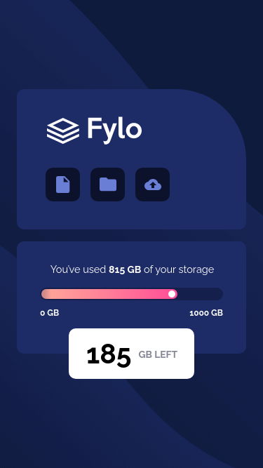
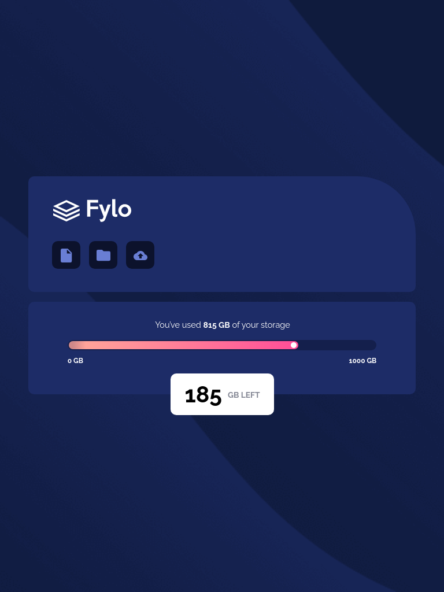
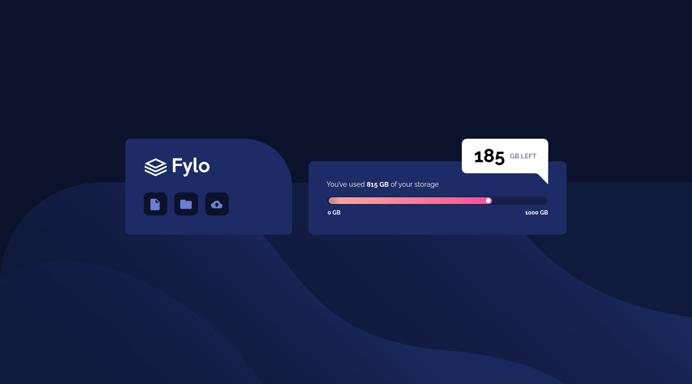
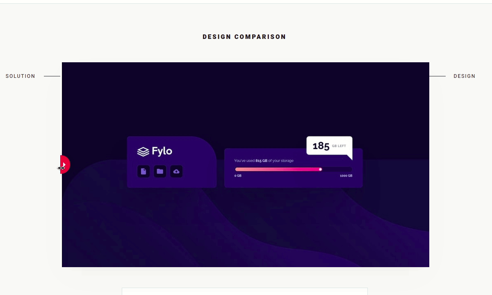
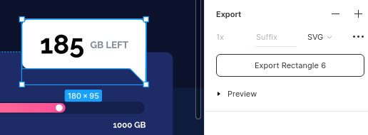
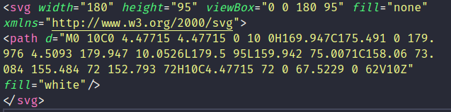

# Frontend Mentor - Fylo data storage component solution

This is a solution to the [Fylo data storage component challenge on Frontend Mentor](https://www.frontendmentor.io/challenges/fylo-data-storage-component-1dZPRbV5n). Frontend Mentor challenges help you improve your coding skills by building realistic projects.

## Table of contents

- [Overview](#overview)
  - [The challenge](#the-challenge)
  - [Screenshot](#screenshot)
  - [Links](#links)
- [My process](#my-process)
  - [Built with](#built-with)
  - [What I learned](#what-i-learned)
  - [Useful resources](#useful-resources)
- [Author](#author)

## Overview

This is the front-end mentor's tenth challenge. The challenge is to build the "Fylo data storage component" and make it as close to the design as possible. Building the desing with whatever you want to finish, any language, framework or tools.

### The challenge

Users should be able to:

- View the optimal layout for the site depending on their device's screen size

## Screenshot

### Mobile design

<p  align="center">
  </img>
</p>

### Tablets design

<p  align="center"></img></p>

### Desktop design

<p  align="center"></img></p>

### result of my work

<p  align="center"></img></p>

### Links

- Solution URL: [My solution for this challenge](https://www.frontendmentor.io/solutions/fylo-data-storage-with-react-and-styled-components-vmNXm8msz)
- Live Site URL: [check the result](https://jcdmeira-fylo-data.netlify.app)

- My figma design: [Figma](https://www.figma.com/file/j4m7wxjWq2cIh5PsdcJKqm/10-fylo-data?node-id=0%3A1)

## My process

### Built with

- Flexbox
- Mobile-first workflow
- [Styled components](https://styled-components.com) - CSS in js with stiled components
- [React](https://reactjs.org/) - JS library

### What I learned

Using styled components and screen size property to differentiate behaviors from visual components.

```JS
import styled, { createGlobalStyle } from 'styled-components';

export const Conteiner = styled.div`
  background-image: url(${(props) =>
    props.screenSize > 1024 ? backgroundDesktop : backgroundMobile});
  background-size: ${(props) =>
    props.screenSize > 1024 ? 'contain' : 'cover'};
  background-position: bottom;
`;
```

Using styled components and clip-path: with CSS path() function to define the shape using definition used in SVG.

```JS
import styled from 'styled-components';

export const GbLeft = styled.div`
  width: 179px;
  height: 72px;
  background: #ffffff;
  border-radius: 10px;
  position: absolute;
  margin-top: 14.1rem;
  display: flex;
  justify-content: center;
  align-items: center;

  @media (min-width: 1200px) {
    width: 18rem;
    height: 9.5rem;
    border-radius: 1rem 1rem 0 1rem;
    margin-bottom: 10.5rem;
    margin-left: 28rem;
    clip-path: path(
      'M0 10C0 4.47715 4.47715 0 10 0H169.947C175.491 0 179.976 4.5093 179.947 10.0526L179.5 95L159.942 75.0071C158.06 73.084 155.484 72 152.793 72H10C4.47715 72 0 67.5229 0 62V10Z'
    );
    padding-bottom: 2.6rem;
  }
`;
```

Use CSS clip-path with the PATH () function, in the internal property, the definition of an SVG image, which will define the format of the div.
The format can be caught by exporting the ready drawing of Figma as SVG.

<p  align="center"></img></p>

When exporting as SVG it is possible to get the path, copy what is inner on the path path and paste inside the function -> clip-path: path ('path path contained in SVG -')

<p  align="center"></img></p>

### Useful resources

- [react tutorial](https://pt-br.reactjs.org/tutorial/tutorial.html) - This helped me structure the components and build the proposed page.
- [my figma design](https://www.figma.com/file/j4m7wxjWq2cIh5PsdcJKqm/10-fylo-data?node-id=0%3A1) - My figma design for help anyone who wants to build this challenge.
- [CSS units conversor - px to VH/VW/REM](https://it-news.pw/pxtovh/) - CSS units conversor .
- [Converting Colors](https://convertingcolors.com) - HSL for all color systems.
- [Clip-path](https://developer.mozilla.org/en-US/docs/Web/CSS/clip-path) - The clip-path CSS property.
- [Function Path](<https://developer.mozilla.org/en-US/docs/Web/CSS/path()>) - The path() CSS function accepts an SVG path string, and is used in CSS Shapes and CSS Motion Path to enable a shape to be drawn..
- [Clip-path generator](https://bennettfeely.com/clippy/) - Generating the values for clip-path polygon .
- [CSS background-image](https://blog.betrybe.com/css/css-background-image/) - Configuring the background image of an element.
- [CSS background-size Property](https://www.w3schools.com/cssref/css3_pr_background-size.asp) - The background-size property specifies the size of the background images.

## Author

- Personal Page - [Jean Carlos De Meira](https://jcdmeira.github.io)
- Frontend Mentor - [@JCDMeira](https://www.frontendmentor.io/profile/JCDMeira)
- Instagram - [@jean.meira10](https://www.instagram.com/jean.meira10/)
- GitHub - [JCDMeira](https://github.com/JCDMeira)
